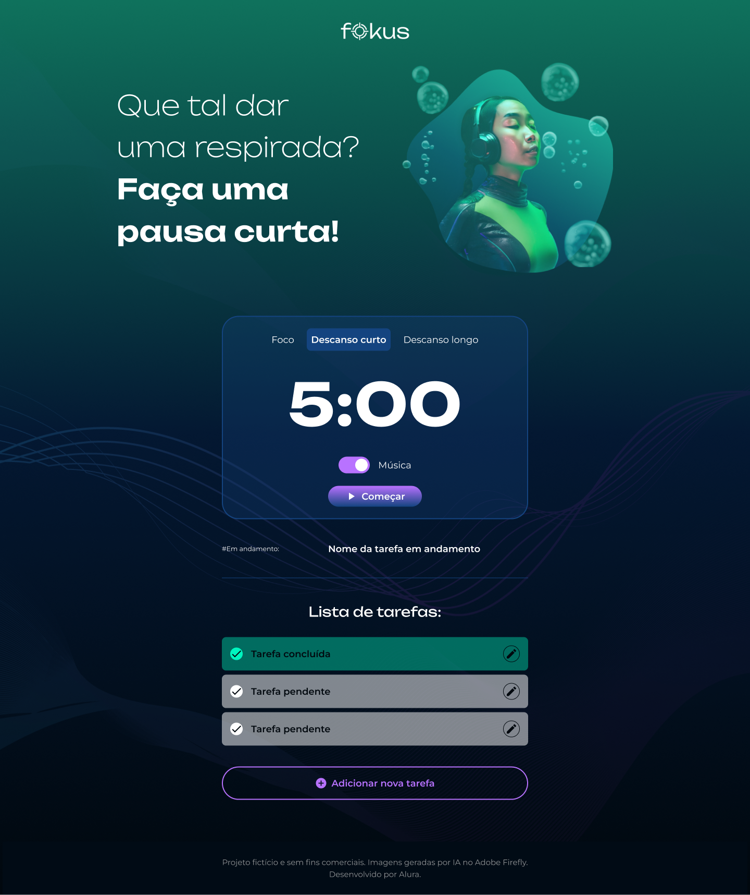
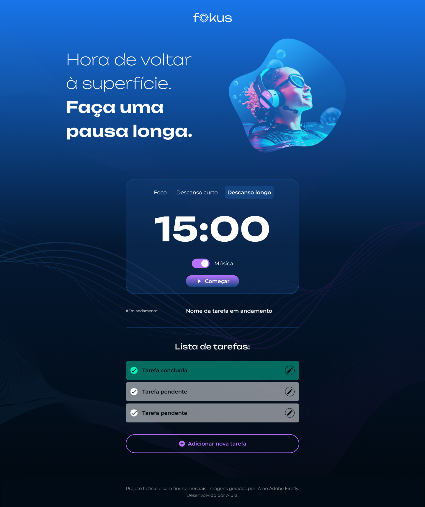

# Fokus - 2024

## Repositório do projeto Fokus, utilizado no curso Manipulando Elementos no DOM - Plataforma Alura utilizando

  

  
    
  
    
  
    

  

    
    
      
    

  

    
    

 

